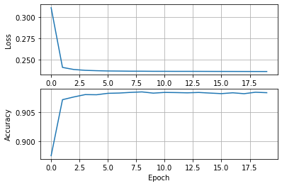

# Case 1. Heart Disease Classification
**Neural Networks for Machine Learning Applications**<br>
06.02.2022<br>
G11 Aitalina Krivoshapkina, Wai Ning Wong, Nontanat Nutsati <br>
Metropolia University of Applied Sciences

## 1. Introduction

This report shows our approach to solving a binary classification problem - **predicting the presence of heart disease**, with a dense neural network.

It involves:
- how to preprocess the data (normalize and encode categories)
- how to make classification on imbalanced data
- how to split a dataset into train and test sets
- how to use the sequential model
- how to train and evaluate the models
- how to analyse results using numerical metrics and graphical plots

## 2. Setup

The following libraries and functions were used


```python
import time
import pandas as pd
import tensorflow as tf
import seaborn as sns
import numpy as np
import matplotlib.pyplot as plt

from sklearn.metrics import classification_report, confusion_matrix
from sklearn.model_selection import train_test_split
from tensorflow.keras import models, layers, losses, metrics, optimizers
```

## 3. Dataset


```python
from google.colab import drive
drive.mount('/content/drive')
%cd /content/drive/MyDrive/Colab Notebooks/
```

Dataset is fetched from https://www.kaggle.com/alexteboul/heart-disease-health-indicators-dataset


```python
raw = pd.read_csv('heart_disease_health_indicators_BRFSS2015.csv')
raw.describe().T
```


<div>
<style scoped>
    .dataframe tbody tr th:only-of-type {
        vertical-align: middle;
    }

    .dataframe tbody tr th {
        vertical-align: top;
    }

    .dataframe thead th {
        text-align: right;
    }
</style>
<table border="1" class="dataframe">
  <thead>
    <tr style="text-align: right;">
      <th></th>
      <th>count</th>
      <th>mean</th>
      <th>std</th>
      <th>min</th>
      <th>25%</th>
      <th>50%</th>
      <th>75%</th>
      <th>max</th>
    </tr>
  </thead>
  <tbody>
    <tr>
      <th>HeartDiseaseorAttack</th>
      <td>253680.0</td>
      <td>0.094186</td>
      <td>0.292087</td>
      <td>0.0</td>
      <td>0.0</td>
      <td>0.0</td>
      <td>0.0</td>
      <td>1.0</td>
    </tr>
    <tr>
      <th>HighBP</th>
      <td>253680.0</td>
      <td>0.429001</td>
      <td>0.494934</td>
      <td>0.0</td>
      <td>0.0</td>
      <td>0.0</td>
      <td>1.0</td>
      <td>1.0</td>
    </tr>
    <tr>
      <th>HighChol</th>
      <td>253680.0</td>
      <td>0.424121</td>
      <td>0.494210</td>
      <td>0.0</td>
      <td>0.0</td>
      <td>0.0</td>
      <td>1.0</td>
      <td>1.0</td>
    </tr>
    <tr>
      <th>CholCheck</th>
      <td>253680.0</td>
      <td>0.962670</td>
      <td>0.189571</td>
      <td>0.0</td>
      <td>1.0</td>
      <td>1.0</td>
      <td>1.0</td>
      <td>1.0</td>
    </tr>
    <tr>
      <th>BMI</th>
      <td>253680.0</td>
      <td>28.382364</td>
      <td>6.608694</td>
      <td>12.0</td>
      <td>24.0</td>
      <td>27.0</td>
      <td>31.0</td>
      <td>98.0</td>
    </tr>
    <tr>
      <th>Smoker</th>
      <td>253680.0</td>
      <td>0.443169</td>
      <td>0.496761</td>
      <td>0.0</td>
      <td>0.0</td>
      <td>0.0</td>
      <td>1.0</td>
      <td>1.0</td>
    </tr>
    <tr>
      <th>Stroke</th>
      <td>253680.0</td>
      <td>0.040571</td>
      <td>0.197294</td>
      <td>0.0</td>
      <td>0.0</td>
      <td>0.0</td>
      <td>0.0</td>
      <td>1.0</td>
    </tr>
    <tr>
      <th>Diabetes</th>
      <td>253680.0</td>
      <td>0.296921</td>
      <td>0.698160</td>
      <td>0.0</td>
      <td>0.0</td>
      <td>0.0</td>
      <td>0.0</td>
      <td>2.0</td>
    </tr>
    <tr>
      <th>PhysActivity</th>
      <td>253680.0</td>
      <td>0.756544</td>
      <td>0.429169</td>
      <td>0.0</td>
      <td>1.0</td>
      <td>1.0</td>
      <td>1.0</td>
      <td>1.0</td>
    </tr>
    <tr>
      <th>Fruits</th>
      <td>253680.0</td>
      <td>0.634256</td>
      <td>0.481639</td>
      <td>0.0</td>
      <td>0.0</td>
      <td>1.0</td>
      <td>1.0</td>
      <td>1.0</td>
    </tr>
    <tr>
      <th>Veggies</th>
      <td>253680.0</td>
      <td>0.811420</td>
      <td>0.391175</td>
      <td>0.0</td>
      <td>1.0</td>
      <td>1.0</td>
      <td>1.0</td>
      <td>1.0</td>
    </tr>
    <tr>
      <th>HvyAlcoholConsump</th>
      <td>253680.0</td>
      <td>0.056197</td>
      <td>0.230302</td>
      <td>0.0</td>
      <td>0.0</td>
      <td>0.0</td>
      <td>0.0</td>
      <td>1.0</td>
    </tr>
    <tr>
      <th>AnyHealthcare</th>
      <td>253680.0</td>
      <td>0.951053</td>
      <td>0.215759</td>
      <td>0.0</td>
      <td>1.0</td>
      <td>1.0</td>
      <td>1.0</td>
      <td>1.0</td>
    </tr>
    <tr>
      <th>NoDocbcCost</th>
      <td>253680.0</td>
      <td>0.084177</td>
      <td>0.277654</td>
      <td>0.0</td>
      <td>0.0</td>
      <td>0.0</td>
      <td>0.0</td>
      <td>1.0</td>
    </tr>
    <tr>
      <th>GenHlth</th>
      <td>253680.0</td>
      <td>2.511392</td>
      <td>1.068477</td>
      <td>1.0</td>
      <td>2.0</td>
      <td>2.0</td>
      <td>3.0</td>
      <td>5.0</td>
    </tr>
    <tr>
      <th>MentHlth</th>
      <td>253680.0</td>
      <td>3.184772</td>
      <td>7.412847</td>
      <td>0.0</td>
      <td>0.0</td>
      <td>0.0</td>
      <td>2.0</td>
      <td>30.0</td>
    </tr>
    <tr>
      <th>PhysHlth</th>
      <td>253680.0</td>
      <td>4.242081</td>
      <td>8.717951</td>
      <td>0.0</td>
      <td>0.0</td>
      <td>0.0</td>
      <td>3.0</td>
      <td>30.0</td>
    </tr>
    <tr>
      <th>DiffWalk</th>
      <td>253680.0</td>
      <td>0.168224</td>
      <td>0.374066</td>
      <td>0.0</td>
      <td>0.0</td>
      <td>0.0</td>
      <td>0.0</td>
      <td>1.0</td>
    </tr>
    <tr>
      <th>Sex</th>
      <td>253680.0</td>
      <td>0.440342</td>
      <td>0.496429</td>
      <td>0.0</td>
      <td>0.0</td>
      <td>0.0</td>
      <td>1.0</td>
      <td>1.0</td>
    </tr>
    <tr>
      <th>Age</th>
      <td>253680.0</td>
      <td>8.032119</td>
      <td>3.054220</td>
      <td>1.0</td>
      <td>6.0</td>
      <td>8.0</td>
      <td>10.0</td>
      <td>13.0</td>
    </tr>
    <tr>
      <th>Education</th>
      <td>253680.0</td>
      <td>5.050434</td>
      <td>0.985774</td>
      <td>1.0</td>
      <td>4.0</td>
      <td>5.0</td>
      <td>6.0</td>
      <td>6.0</td>
    </tr>
    <tr>
      <th>Income</th>
      <td>253680.0</td>
      <td>6.053875</td>
      <td>2.071148</td>
      <td>1.0</td>
      <td>5.0</td>
      <td>7.0</td>
      <td>8.0</td>
      <td>8.0</td>
    </tr>
  </tbody>
</table>
</div>


## 4. Preprocessing
No missing value. <br>
The label is 'HeartDiseasorAttack' and the rest are features. <br>
The data are splitted into 0.75 for training and 0.25 for testing.


```python
target = raw['HeartDiseaseorAttack']
features = raw.drop('HeartDiseaseorAttack', axis = 1)
features.describe().T
```


<div>
<style scoped>
    .dataframe tbody tr th:only-of-type {
        vertical-align: middle;
    }

    .dataframe tbody tr th {
        vertical-align: top;
    }

    .dataframe thead th {
        text-align: right;
    }
</style>
<table border="1" class="dataframe">
  <thead>
    <tr style="text-align: right;">
      <th></th>
      <th>count</th>
      <th>mean</th>
      <th>std</th>
      <th>min</th>
      <th>25%</th>
      <th>50%</th>
      <th>75%</th>
      <th>max</th>
    </tr>
  </thead>
  <tbody>
    <tr>
      <th>HighBP</th>
      <td>253680.0</td>
      <td>0.429001</td>
      <td>0.494934</td>
      <td>0.0</td>
      <td>0.0</td>
      <td>0.0</td>
      <td>1.0</td>
      <td>1.0</td>
    </tr>
    <tr>
      <th>HighChol</th>
      <td>253680.0</td>
      <td>0.424121</td>
      <td>0.494210</td>
      <td>0.0</td>
      <td>0.0</td>
      <td>0.0</td>
      <td>1.0</td>
      <td>1.0</td>
    </tr>
    <tr>
      <th>CholCheck</th>
      <td>253680.0</td>
      <td>0.962670</td>
      <td>0.189571</td>
      <td>0.0</td>
      <td>1.0</td>
      <td>1.0</td>
      <td>1.0</td>
      <td>1.0</td>
    </tr>
    <tr>
      <th>BMI</th>
      <td>253680.0</td>
      <td>28.382364</td>
      <td>6.608694</td>
      <td>12.0</td>
      <td>24.0</td>
      <td>27.0</td>
      <td>31.0</td>
      <td>98.0</td>
    </tr>
    <tr>
      <th>Smoker</th>
      <td>253680.0</td>
      <td>0.443169</td>
      <td>0.496761</td>
      <td>0.0</td>
      <td>0.0</td>
      <td>0.0</td>
      <td>1.0</td>
      <td>1.0</td>
    </tr>
    <tr>
      <th>Stroke</th>
      <td>253680.0</td>
      <td>0.040571</td>
      <td>0.197294</td>
      <td>0.0</td>
      <td>0.0</td>
      <td>0.0</td>
      <td>0.0</td>
      <td>1.0</td>
    </tr>
    <tr>
      <th>Diabetes</th>
      <td>253680.0</td>
      <td>0.296921</td>
      <td>0.698160</td>
      <td>0.0</td>
      <td>0.0</td>
      <td>0.0</td>
      <td>0.0</td>
      <td>2.0</td>
    </tr>
    <tr>
      <th>PhysActivity</th>
      <td>253680.0</td>
      <td>0.756544</td>
      <td>0.429169</td>
      <td>0.0</td>
      <td>1.0</td>
      <td>1.0</td>
      <td>1.0</td>
      <td>1.0</td>
    </tr>
    <tr>
      <th>Fruits</th>
      <td>253680.0</td>
      <td>0.634256</td>
      <td>0.481639</td>
      <td>0.0</td>
      <td>0.0</td>
      <td>1.0</td>
      <td>1.0</td>
      <td>1.0</td>
    </tr>
    <tr>
      <th>Veggies</th>
      <td>253680.0</td>
      <td>0.811420</td>
      <td>0.391175</td>
      <td>0.0</td>
      <td>1.0</td>
      <td>1.0</td>
      <td>1.0</td>
      <td>1.0</td>
    </tr>
    <tr>
      <th>HvyAlcoholConsump</th>
      <td>253680.0</td>
      <td>0.056197</td>
      <td>0.230302</td>
      <td>0.0</td>
      <td>0.0</td>
      <td>0.0</td>
      <td>0.0</td>
      <td>1.0</td>
    </tr>
    <tr>
      <th>AnyHealthcare</th>
      <td>253680.0</td>
      <td>0.951053</td>
      <td>0.215759</td>
      <td>0.0</td>
      <td>1.0</td>
      <td>1.0</td>
      <td>1.0</td>
      <td>1.0</td>
    </tr>
    <tr>
      <th>NoDocbcCost</th>
      <td>253680.0</td>
      <td>0.084177</td>
      <td>0.277654</td>
      <td>0.0</td>
      <td>0.0</td>
      <td>0.0</td>
      <td>0.0</td>
      <td>1.0</td>
    </tr>
    <tr>
      <th>GenHlth</th>
      <td>253680.0</td>
      <td>2.511392</td>
      <td>1.068477</td>
      <td>1.0</td>
      <td>2.0</td>
      <td>2.0</td>
      <td>3.0</td>
      <td>5.0</td>
    </tr>
    <tr>
      <th>MentHlth</th>
      <td>253680.0</td>
      <td>3.184772</td>
      <td>7.412847</td>
      <td>0.0</td>
      <td>0.0</td>
      <td>0.0</td>
      <td>2.0</td>
      <td>30.0</td>
    </tr>
    <tr>
      <th>PhysHlth</th>
      <td>253680.0</td>
      <td>4.242081</td>
      <td>8.717951</td>
      <td>0.0</td>
      <td>0.0</td>
      <td>0.0</td>
      <td>3.0</td>
      <td>30.0</td>
    </tr>
    <tr>
      <th>DiffWalk</th>
      <td>253680.0</td>
      <td>0.168224</td>
      <td>0.374066</td>
      <td>0.0</td>
      <td>0.0</td>
      <td>0.0</td>
      <td>0.0</td>
      <td>1.0</td>
    </tr>
    <tr>
      <th>Sex</th>
      <td>253680.0</td>
      <td>0.440342</td>
      <td>0.496429</td>
      <td>0.0</td>
      <td>0.0</td>
      <td>0.0</td>
      <td>1.0</td>
      <td>1.0</td>
    </tr>
    <tr>
      <th>Age</th>
      <td>253680.0</td>
      <td>8.032119</td>
      <td>3.054220</td>
      <td>1.0</td>
      <td>6.0</td>
      <td>8.0</td>
      <td>10.0</td>
      <td>13.0</td>
    </tr>
    <tr>
      <th>Education</th>
      <td>253680.0</td>
      <td>5.050434</td>
      <td>0.985774</td>
      <td>1.0</td>
      <td>4.0</td>
      <td>5.0</td>
      <td>6.0</td>
      <td>6.0</td>
    </tr>
    <tr>
      <th>Income</th>
      <td>253680.0</td>
      <td>6.053875</td>
      <td>2.071148</td>
      <td>1.0</td>
      <td>5.0</td>
      <td>7.0</td>
      <td>8.0</td>
      <td>8.0</td>
    </tr>
  </tbody>
</table>
</div>


```python
features.info()
```

    <class 'pandas.core.frame.DataFrame'>
    RangeIndex: 253680 entries, 0 to 253679
    Data columns (total 21 columns):
     #   Column             Non-Null Count   Dtype  
    ---  ------             --------------   -----  
     0   HighBP             253680 non-null  float64
     1   HighChol           253680 non-null  float64
     2   CholCheck          253680 non-null  float64
     3   BMI                253680 non-null  float64
     4   Smoker             253680 non-null  float64
     5   Stroke             253680 non-null  float64
     6   Diabetes           253680 non-null  float64
     7   PhysActivity       253680 non-null  float64
     8   Fruits             253680 non-null  float64
     9   Veggies            253680 non-null  float64
     10  HvyAlcoholConsump  253680 non-null  float64
     11  AnyHealthcare      253680 non-null  float64
     12  NoDocbcCost        253680 non-null  float64
     13  GenHlth            253680 non-null  float64
     14  MentHlth           253680 non-null  float64
     15  PhysHlth           253680 non-null  float64
     16  DiffWalk           253680 non-null  float64
     17  Sex                253680 non-null  float64
     18  Age                253680 non-null  float64
     19  Education          253680 non-null  float64
     20  Income             253680 non-null  float64
    dtypes: float64(21)
    memory usage: 40.6 MB


```python
target.value_counts()
```


    0.0    229787
    1.0     23893
    Name: HeartDiseaseorAttack, dtype: int64


```python
X_train, X_test, y_train, y_test = train_test_split(features, target, random_state=11,train_size=0.75)
np.shape(X_train), np.shape(X_test)
```


    ((190260, 21), (63420, 21))


```python
from sklearn.preprocessing import StandardScaler
scaler = StandardScaler()
X_train = scaler.fit_transform(X_train)
X_test = scaler.transform(X_test)
```

## 5. Modeling

Neural Network model with 2 layer. The input layer uses ReLU activation function and the output uses Sigmoid activation function. <br>
Optimizer is RMS. <br>
Loss function is Binary Crossentropy <br>
Metrics Setting for evaluation is Binary Accuracy.


```python
normalize = layers.Normalization()
normalize.adapt(X_train)

def make_model():
    model = models.Sequential([
        normalize,
        layers.Dense(5, activation = 'relu'),
        layers.Dense(1, activation = 'sigmoid')
    ])
    
    
    model.compile(
        optimizer = optimizers.RMSprop(),
        loss = losses.BinaryCrossentropy(),
        metrics = metrics.BinaryAccuracy(name = 'acc')
    )
    
    return model
    
model = make_model()
model.summary()
```

    Model: "sequential_5"
    _________________________________________________________________
    Layer (type)                 Output Shape              Param #   
    =================================================================
    normalization_5 (Normalizati (None, 21)                43        
    _________________________________________________________________
    dense_11 (Dense)             (None, 5)                 110       
    _________________________________________________________________
    dense_12 (Dense)             (None, 1)                 6         
    =================================================================
    Total params: 159
    Trainable params: 116
    Non-trainable params: 43
    _________________________________________________________________


## 6. Training
Go through the training set 20 times with the batch size of 128.
Spent 0.617 sec/epoch the total time is 12.34 sec.


```python
EPOCHS = 20

t0 = time.time()
r = model.fit(
    X_train,
    y_train,
    epochs = EPOCHS,
    batch_size = 128,
    verbose = 0,
    )

t1 = time.time()
etime = t1 - t0
print(f'Total elapsed time {etime:.2f} s and {etime/EPOCHS:.3f} s/epoch')
```

    Total elapsed time 14.19 s and 0.710 s/epoch


## 7. Performance and evaluation


```python
epochs = r.epoch
loss = r.history['loss']
acc = r.history['acc']
```


```python
plt.subplot(2, 1, 1)
plt.plot(epochs, loss)
plt.grid()
plt.ylabel('Loss')

plt.subplot(2, 1, 2)
plt.plot(epochs, acc)
plt.grid()
plt.ylabel('Accuracy')
plt.xlabel('Epoch')
plt.show()
```


    

    


```python
print(f'Training loss = {loss[-1]:.3f}')
print(f'Training accuracy = {acc[-1]:.3f}')
```

    Training loss = 0.236
    Training accuracy = 0.908


```python
test_loss, test_acc = model.evaluate(X_test, y_test, verbose = 0)
print(f'Test loss = {test_loss:.3f}')
print(f'Test accuracy = {test_acc:.3f}')
```

    Test loss = 0.241
    Test accuracy = 0.908


```python
predictions = model.predict(X_train)
predictions = 1.0*(predictions >= 0.5)
```


```python
cm = confusion_matrix(y_train, predictions)
print(cm)
```

    [[171415    928]
     [ 16539   1378]]


```python
tn, fp, fn, tp = confusion_matrix(y_train, predictions).ravel()
print('              Confusion matrix')
print(f'                 Prediction')
print(f'Diagnose  Healthy   Disease      SUM')
print(f'Healthy  {tn:8d}  {fp:8d} {tn+fp:8d}')
print(f'Disease  {fn:8d}  {tp:8d} {fn+tp:8d}')
print(f'SUM      {tn+fn:8d}  {fp+tp:8d} {tn+fp+fn+tp:8d}')
```

                  Confusion matrix
                     Prediction
    Diagnose  Healthy   Disease      SUM
    Healthy    171415       928   172343
    Disease     16539      1378    17917
    SUM        187954      2306   190260


```python
cr = classification_report(y_train, predictions, target_names = ['Healthy', 'Disease'])
print(cr)
```

                  precision    recall  f1-score   support
    
         Healthy       0.91      0.99      0.95    172343
         Disease       0.60      0.08      0.14     17917
    
        accuracy                           0.91    190260
       macro avg       0.75      0.54      0.54    190260
    weighted avg       0.88      0.91      0.87    190260
    


```python
print(f'Precision for Healthy = {tn/(tn+fn):.2f}')
print(f'Precision for Disease = {tp/(fp+tp):.2f}')
```

    Precision for Healthy = 0.91
    Precision for Disease = 0.60


## 8. Discussion and conclusions

We've tried 2 to 4 layers, 4 to 6 neurons, higher and lower epochs and higher and lower batch sizes. From our observation, their accuracies don't have a significant different between each others. The accuracy is somewhere between 90.6/90.7. Our best model has 2 layers. Input and hidden layers use ReLU activation function and the output layer uses Sigmoid activation function. The training set is 75% and the test set is 25%. The result of this model is 0.907 accuracy and 0.241 with the testing set. Our main observation is that the imbalance of the data (The difference of the amount of healthy and disease in the data) may causes the model to stuck at 90.7% accuracy after the trial and error with other settings. So, maybe the model can be improved by adjusting the imbalance of the data in the future.
