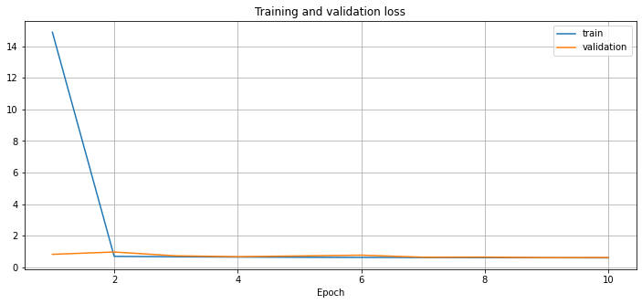

# Case 3. Patient Drug Review

*Neural Networks for Machine Learning Applications*<br>
13.03.2022<br>
G11 Aitalina Krivoshapkina, Wai Ning Wong, Nontanat Nutsati <br>
Metropolia University of Applied Sciences

## Introduction

The aim of this Notebook is to work as introduction to text preprocessing functions for neural networks.

## Acknowledgments

- The dataset is from: [UCI ML Drug Review dataset](https://www.kaggle.com/jessicali9530/kuc-hackathon-winter-2018).
- [Text classification from scratch](https://keras.io/examples/nlp/text_classification_from_scratch/)
- [Using pre-trained word embeddings](https://keras.io/examples/nlp/pretrained_word_embeddings/)
- [Best practices for text classification deep learning](https://machinelearningmastery.com/best-practices-document-classification-deep-learning/)


## Setup

Read in the needed libraries.


```python
# Read the basic libraries (similar start as in Kaggle kernels)

import time # for timing
import numpy as np # linear algebra
import pandas as pd # data processing, CSV file I/O (e.g. pd.read_csv)
import matplotlib.pyplot as plt

# Neural network libraries
import tensorflow as tf

# Preprocessing utilities
from sklearn.model_selection import train_test_split # preprocessing datasets
from tensorflow.keras.preprocessing.text import Tokenizer # text preprocessing
from tensorflow.keras.preprocessing.sequence import pad_sequences # text preprocessing
from tensorflow.keras.utils import to_categorical # for one-hot-encoding

# For modeling
from tensorflow.keras.models import Model
from tensorflow.keras.models import Sequential # modeling neural networks
from tensorflow.keras.layers import Dense, Input, Activation, Embedding, Dropout
from tensorflow.keras.layers import Conv1D, MaxPooling1D, GlobalMaxPooling1D, GlobalAveragePooling1D
from tensorflow.keras.initializers import Constant

# Final metrics
from sklearn.metrics import confusion_matrix, classification_report, cohen_kappa_score

# Operating system
import os

# Check the tensorflow version
print('tensorflow version:', tf.__version__)
```

    tensorflow version: 2.6.0


```python
# Change the default figure size
plt.rcParams['figure.figsize'] = [12, 5]
```

## Datasets

Check what data is available.


```python
print(os.listdir("drug"))
```

    ['drugsComTrain_raw.csv', 'drugsComTest_raw.csv']


Read in the train and test sets.


```python
# Create dataframes train and test
train = pd.read_csv('drug/drugsComTrain_raw.csv')
test = pd.read_csv('drug/drugsComTest_raw.csv')

# Show the first 5 rows of the train set
train.head()
```


<div>
<style scoped>
    .dataframe tbody tr th:only-of-type {
        vertical-align: middle;
    }

    .dataframe tbody tr th {
        vertical-align: top;
    }

    .dataframe thead th {
        text-align: right;
    }
</style>
<table border="1" class="dataframe">
  <thead>
    <tr style="text-align: right;">
      <th></th>
      <th>uniqueID</th>
      <th>drugName</th>
      <th>condition</th>
      <th>review</th>
      <th>rating</th>
      <th>date</th>
      <th>usefulCount</th>
    </tr>
  </thead>
  <tbody>
    <tr>
      <th>0</th>
      <td>206461</td>
      <td>Valsartan</td>
      <td>Left Ventricular Dysfunction</td>
      <td>"It has no side effect, I take it in combinati...</td>
      <td>9</td>
      <td>20-May-12</td>
      <td>27</td>
    </tr>
    <tr>
      <th>1</th>
      <td>95260</td>
      <td>Guanfacine</td>
      <td>ADHD</td>
      <td>"My son is halfway through his fourth week of ...</td>
      <td>8</td>
      <td>27-Apr-10</td>
      <td>192</td>
    </tr>
    <tr>
      <th>2</th>
      <td>92703</td>
      <td>Lybrel</td>
      <td>Birth Control</td>
      <td>"I used to take another oral contraceptive, wh...</td>
      <td>5</td>
      <td>14-Dec-09</td>
      <td>17</td>
    </tr>
    <tr>
      <th>3</th>
      <td>138000</td>
      <td>Ortho Evra</td>
      <td>Birth Control</td>
      <td>"This is my first time using any form of birth...</td>
      <td>8</td>
      <td>3-Nov-15</td>
      <td>10</td>
    </tr>
    <tr>
      <th>4</th>
      <td>35696</td>
      <td>Buprenorphine / naloxone</td>
      <td>Opiate Dependence</td>
      <td>"Suboxone has completely turned my life around...</td>
      <td>9</td>
      <td>27-Nov-16</td>
      <td>37</td>
    </tr>
  </tbody>
</table>
</div>


Take comment away, when you are constructing your model.
Take 15,000 samples from train set for demonstration and model construction purposes. 


```python
#train = train.sample(15000, random_state = 2022)
```

## Text processing

Tokenize the text data. Use [keras Tokenizer](https://www.tensorflow.org/api_docs/python/tf/keras/preprocessing/text/Tokenizer) for that purpose. The parameters to play with are 

- `max_features` - how many unique words are used from the text data
- `sequence_length` - the maximum length of the review. All reviews are zero-padded to this length.


```python
%%time

max_features = 20000
sequence_length = 200

# Tokenize the text
samples = train['review']
tokenizer = Tokenizer(num_words = max_features)
tokenizer.fit_on_texts(samples)

# Convert text to sequences
sequences = tokenizer.texts_to_sequences(samples)

# Print out the number of unique tokens
word_index = tokenizer.word_index
print(f'Found {len(word_index)} unique tokens.')

```

    Found 51429 unique tokens.
    CPU times: user 16.2 s, sys: 92.1 ms, total: 16.3 s
    Wall time: 16.3 s


Pad all text sequences to equal length.


```python
data = pad_sequences(sequences, maxlen = sequence_length)
print('Shape of data tensor:', data.shape)
#data[:5]
```

    Shape of data tensor: (161297, 200)


Categorize the ratings. Use 3 categories:

- when ratings > 6, then labels = 2.0 (positive)
- when ratings >= 5 and ratings <= 6, then labels = 1.0 (neutral)
- when ratings < 5, then labels = 0.0 (negative)


```python
ratings = train['rating'].values
labels = 1.0*(ratings > 6) + 1.0*(ratings >= 5)
```

One-hot-code the labels.


```python
hot_labels = to_categorical(labels)
print('Shape of label tensor:', hot_labels.shape)
hot_labels[:3]
```

    Shape of label tensor: (161297, 3)


    array([[0., 0., 1.],
           [0., 0., 1.],
           [0., 1., 0.]], dtype=float32)


Split the training data to training and validation datasets. Use 75:25 rule. Use `random.shuffle` for rearrange the indices.


```python
VALIDATION_SPLIT = 0.25
N = int(VALIDATION_SPLIT * data.shape[0])

# Rearrange the data and the hot-encoded labels
indices = np.arange(data.shape[0])
np.random.shuffle(indices)

data = data[indices]
hot_labels = hot_labels[indices]

# Split into train and validation datasets
train_data = data[:-N]
train_cat = hot_labels[:-N]
val_data = data[-N:]
val_cat = hot_labels[-N:]
```

## Model

The model is straighforward sequential model following the [Best practices for text classification deep learning](https://machinelearningmastery.com/best-practices-document-classification-deep-learning/). Compare to:
<figure>
    
    <figcaption>An example of a CNN Filter and Polling Architecture for Natural Language Processing.
Taken from “Convolutional Neural Networks for Sentence Classification”, 2014.</figcaption>
</figure>


```python
embedding_dim = 128
model = Sequential([
    Embedding(max_features + 1, embedding_dim),
    Dropout(0.6),
    Conv1D(128, 32, padding="valid", activation="relu", strides=3),
    GlobalAveragePooling1D(),
    Dropout(0.6),
    Dense(128, activation="relu", kernel_regularizer=regularizers.l2(3)),
    Dense(3, activation = 'softmax')])

# Compile
model.compile(loss = 'categorical_crossentropy',
              optimizer = 'rmsprop',
              metrics = ['acc'])

model.summary()
```

    Model: "sequential_7"
    _________________________________________________________________
    Layer (type)                 Output Shape              Param #   
    =================================================================
    embedding_7 (Embedding)      (None, None, 128)         2560128   
    _________________________________________________________________
    dropout_14 (Dropout)         (None, None, 128)         0         
    _________________________________________________________________
    conv1d_7 (Conv1D)            (None, None, 128)         524416    
    _________________________________________________________________
    global_average_pooling1d_7 ( (None, 128)               0         
    _________________________________________________________________
    dropout_15 (Dropout)         (None, 128)               0         
    _________________________________________________________________
    dense_14 (Dense)             (None, 128)               16512     
    _________________________________________________________________
    dense_15 (Dense)             (None, 3)                 387       
    =================================================================
    Total params: 3,101,443
    Trainable params: 3,101,443
    Non-trainable params: 0
    _________________________________________________________________


## Training

Traind the data. Use 10 epochs. Use `%%time` cell magic to count timing.


```python
%%time
history = model.fit(train_data, train_cat,
          batch_size = 128,
          epochs = 10,
          verbose = 1,
          validation_data=(val_data, val_cat))
```

    Epoch 1/10
    946/946 [==============================] - 123s 129ms/step - loss: 14.8853 - acc: 0.7041 - val_loss: 0.8207 - val_acc: 0.6952
    Epoch 2/10
    946/946 [==============================] - 134s 141ms/step - loss: 0.6915 - acc: 0.7562 - val_loss: 0.9667 - val_acc: 0.6840
    Epoch 3/10
    946/946 [==============================] - 138s 146ms/step - loss: 0.6630 - acc: 0.7694 - val_loss: 0.7232 - val_acc: 0.7630
    Epoch 4/10
    946/946 [==============================] - 140s 148ms/step - loss: 0.6456 - acc: 0.7773 - val_loss: 0.6706 - val_acc: 0.7819
    Epoch 5/10
    946/946 [==============================] - 149s 158ms/step - loss: 0.6326 - acc: 0.7833 - val_loss: 0.7159 - val_acc: 0.7449
    Epoch 6/10
    946/946 [==============================] - 172s 182ms/step - loss: 0.6238 - acc: 0.7874 - val_loss: 0.7661 - val_acc: 0.7464
    Epoch 7/10
    946/946 [==============================] - 141s 149ms/step - loss: 0.6150 - acc: 0.7895 - val_loss: 0.6384 - val_acc: 0.7891
    Epoch 8/10
    946/946 [==============================] - 141s 149ms/step - loss: 0.6085 - acc: 0.7929 - val_loss: 0.6438 - val_acc: 0.7896
    Epoch 9/10
    946/946 [==============================] - 143s 151ms/step - loss: 0.6022 - acc: 0.7955 - val_loss: 0.6093 - val_acc: 0.7939
    Epoch 10/10
    946/946 [==============================] - 143s 151ms/step - loss: 0.5962 - acc: 0.7980 - val_loss: 0.6180 - val_acc: 0.7944
    CPU times: user 3h 15min 31s, sys: 18min 38s, total: 3h 34min 9s
    Wall time: 23min 42s


`CPU times: user 3min 14s, sys: 11.3 s, total: 3min 25s`\
`Wall time: 56.2 s`

## Validation results

Standard graphics for loss function and accuracy.


```python
# Plot the accuracy and loss
acc = history.history['acc']
val_acc = history.history['val_acc']
loss = history.history['loss']
val_loss = history.history['val_loss']
e = np.arange(len(acc)) + 1

plt.plot(e, acc, label = 'train')
plt.plot(e, val_acc, label = 'validation')
plt.title('Training and validation accuracy')
plt.xlabel('Epoch')
plt.grid()
plt.legend()

plt.figure()

plt.plot(e, loss, label = 'train')
plt.plot(e, val_loss, label = 'validation')
plt.title('Training and validation loss')
plt.xlabel('Epoch')
plt.grid()
plt.legend()

plt.show()
```


    

    


    

    


## Calculate metrics

As the output is one-hot-encoded, we convert them to numeric values with `numpy.argmax` function. Then we are ready to calculate the classification report.


```python
# Find the predicted values for the validation set
pred_labels = np.argmax(model.predict(val_data), axis = 1)
val_labels = np.argmax(val_cat, axis = 1)

# Calculate the classification report
cr = classification_report(val_labels, pred_labels)
print(cr)
```

                  precision    recall  f1-score   support
    
               0       0.72      0.67      0.70     10084
               1       0.00      0.00      0.00      3559
               2       0.82      0.95      0.88     26681
    
        accuracy                           0.79     40324
       macro avg       0.51      0.54      0.52     40324
    weighted avg       0.72      0.79      0.75     40324
    


    /opt/anaconda3/lib/python3.8/site-packages/sklearn/metrics/_classification.py:1245: UndefinedMetricWarning: Precision and F-score are ill-defined and being set to 0.0 in labels with no predicted samples. Use `zero_division` parameter to control this behavior.
      _warn_prf(average, modifier, msg_start, len(result))
    /opt/anaconda3/lib/python3.8/site-packages/sklearn/metrics/_classification.py:1245: UndefinedMetricWarning: Precision and F-score are ill-defined and being set to 0.0 in labels with no predicted samples. Use `zero_division` parameter to control this behavior.
      _warn_prf(average, modifier, msg_start, len(result))
    /opt/anaconda3/lib/python3.8/site-packages/sklearn/metrics/_classification.py:1245: UndefinedMetricWarning: Precision and F-score are ill-defined and being set to 0.0 in labels with no predicted samples. Use `zero_division` parameter to control this behavior.
      _warn_prf(average, modifier, msg_start, len(result))


Also confusion matrix might give some insights where we could improve our model and training.


```python
# Calculate the confusion matrix
cm = confusion_matrix(val_labels, pred_labels).T
print(cm)
```

    [[ 6747  1184  1394]
     [    0     0     0]
     [ 3337  2375 25287]]


The [original Grässer et al. (2018) article](https://kdd.cs.ksu.edu/Publications/Student/kallumadi2018aspect.pdf) used Cohen's kappa metrics to illustrate the validity of the model.


```python
# Calculate the cohen's kappa, both with linear and quadratic weights
k = cohen_kappa_score(val_labels, pred_labels)
print(f"Cohen's kappa (linear)    = {k:.4f}")
k2 = cohen_kappa_score(val_labels, pred_labels, weights = 'quadratic')
print(f"Cohen's kappa (quadratic) = {k2:.4f}")
```

    Cohen's kappa (linear)    = 0.5258
    Cohen's kappa (quadratic) = 0.6205


More info: 
- [sklearn.metrics.cohen_kappa_score](https://scikit-learn.org/stable/modules/generated/sklearn.metrics.cohen_kappa_score.html)
- [Cohen's kappa (Wikipedia)](https://en.wikipedia.org/wiki/Cohen%27s_kappa)
