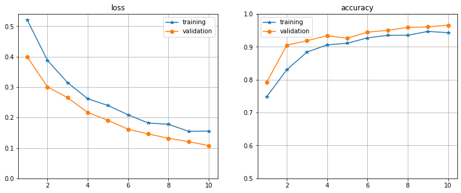
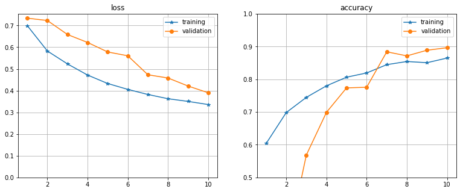
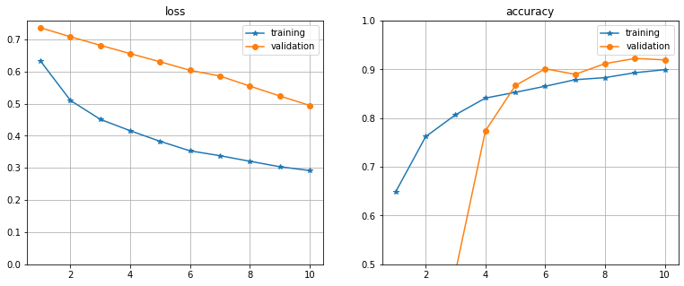
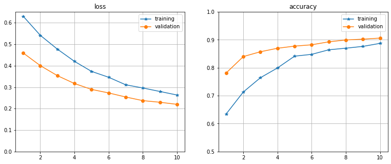
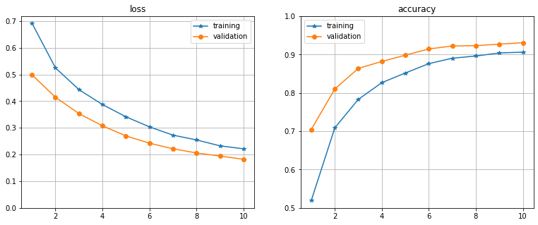

# Case 2. Pneumonia X-ray image analysis
G11 Aitalina Krivoshapkina, Wai Ning Wong, Nontanat Nutsati <br>
Last edited: 27.02.2022<br>
Neural Networks for Health Technology Applications<br>
[Helsinki Metropolia University of Applied Sciences](http://www.metropolia.fi/en/)<br>

## Introduction and Set-up

The aim of this Notebook is to use convolutional neural networks to create a binary classifier for x-ray chest images. The notebook has 5 models. Each one performs differently. <br>
<br>
The following cells contain all the necessary libraries to run this notebook and a specificity function to calculate the model's specificity, which is hence, used to calculate the sensitivity with SensitivityAtSpecificity from keras.metrics.


```python
# Required libraries
%pylab inline
import os
import tensorflow as tf
from tensorflow import keras
from tensorflow.keras import layers, models, optimizers
from tensorflow.keras.models import Sequential
from tensorflow.keras.preprocessing.image import ImageDataGenerator
from sklearn.metrics import classification_report
from tensorflow.keras.metrics import SensitivityAtSpecificity
import tensorflow.keras.backend as K

print("tensorflow", tf.__version__)
```

    Populating the interactive namespace from numpy and matplotlib
    tensorflow 2.6.0


```python
def specificity(y_true, y_pred):
    TN = np.logical_and(K.eval(y_true) == 0, K.eval(y_pred) == 0)
    FP = np.logical_and(K.eval(y_true) == 0, K.eval(y_pred) == 1)

    TN = K.sum(K.variable(TN))
    FP = K.sum(K.variable(FP))

    specificity = TN / (TN + FP + K.epsilon())
    return specificity
```

# Data

The data is fetched from https://www.kaggle.com/paultimothymooney/chest-xray-pneumonia, with 5,863 images in 2 categories.

Pictures of chest x-ray images are divided into train, validation and testing sets.

Batch size, image height and width are initialized to 128.


```python
# Training settings
batch_size = 128
img_height = 128
img_width = 128
```


```python
train_dir = 'chest_xray/train'
test_dir = 'chest_xray/test'

# Training dataset
train_ds = tf.keras.preprocessing.image_dataset_from_directory(
  train_dir,
  validation_split = 0.2,
  subset = "training",
  seed = 123,
  image_size = (img_height, img_width),
  batch_size = batch_size)

# Validation dataset
val_ds = tf.keras.preprocessing.image_dataset_from_directory(
  train_dir,
  validation_split = 0.2,
  subset = "validation",
  seed = 123,
  image_size = (img_height, img_width),
  batch_size = batch_size)

# Test dataset
test_ds = tf.keras.preprocessing.image_dataset_from_directory(
  test_dir,
  seed = 123,
  image_size = (img_height, img_width),
  batch_size = batch_size)
```

    Found 5216 files belonging to 2 classes.
    Using 4173 files for training.
    Found 5216 files belonging to 2 classes.
    Using 1043 files for validation.
    Found 624 files belonging to 2 classes.


```python
# Speeding up the data processing
AUTOTUNE = tf.data.experimental.AUTOTUNE
train_ds = train_ds.cache().shuffle(1000).prefetch(buffer_size=AUTOTUNE)
val_ds = val_ds.cache().prefetch(buffer_size=AUTOTUNE)
```

# Model and training, Results and Discussion

5 models are presented in this section. Each with network setup, training, validation loss graph, classification report, specificity & sensitivity on test set.

## Model 1

Basic and Simple Network Structure based on tutorial at https://www.tensorflow.org/tutorials/images/classification

- 3 convolution blocks (tf.keras.layers.Conv2D) 
- with a max pooling layer (tf.keras.layers.MaxPooling2D) in each of them. 
- a fully-connected layer (tf.keras.layers.Dense) with 128 units on top of it that is activated by a ReLU activation function ('relu').


```python
model_1 = Sequential([
  layers.experimental.preprocessing.Rescaling(1./255, input_shape=(img_height, img_width, 3)),
  layers.Conv2D(8, 3, padding='same', activation='relu'),
  layers.MaxPooling2D(),
  layers.Conv2D(16, 3, padding='same', activation='relu'),
  layers.MaxPooling2D(),
  layers.Conv2D(32, 3, padding='same', activation='relu'),
  layers.MaxPooling2D(),
  layers.Flatten(),
  layers.Dense(128, activation='relu'),
  layers.Dense(1, activation = 'sigmoid')
])

model_1.compile(loss = 'binary_crossentropy',
              optimizer = optimizers.RMSprop(learning_rate = 1e-4),
              metrics = ['accuracy'])

model_1.summary()
```

    Model: "sequential_2"
    _________________________________________________________________
    Layer (type)                 Output Shape              Param #   
    =================================================================
    rescaling_1 (Rescaling)      (None, 128, 128, 3)       0         
    _________________________________________________________________
    conv2d_3 (Conv2D)            (None, 128, 128, 8)       224       
    _________________________________________________________________
    max_pooling2d_3 (MaxPooling2 (None, 64, 64, 8)         0         
    _________________________________________________________________
    conv2d_4 (Conv2D)            (None, 64, 64, 16)        1168      
    _________________________________________________________________
    max_pooling2d_4 (MaxPooling2 (None, 32, 32, 16)        0         
    _________________________________________________________________
    conv2d_5 (Conv2D)            (None, 32, 32, 32)        4640      
    _________________________________________________________________
    max_pooling2d_5 (MaxPooling2 (None, 16, 16, 32)        0         
    _________________________________________________________________
    flatten_1 (Flatten)          (None, 8192)              0         
    _________________________________________________________________
    dense_3 (Dense)              (None, 128)               1048704   
    _________________________________________________________________
    dense_4 (Dense)              (None, 1)                 129       
    =================================================================
    Total params: 1,054,865
    Trainable params: 1,054,865
    Non-trainable params: 0
    _________________________________________________________________


```python
%%time

N = 10

history_1 = model_1.fit(      
      train_ds,
      validation_data = val_ds,
      verbose = 0, # FOR FINAL VERSION, CHANGE TO 0!
      epochs = N
      )

print('Batch size = ', batch_size)

# Save the model
model_1.save('model_1.h5')
```

    Batch size =  128
    CPU times: user 13min 7s, sys: 3min 36s, total: 16min 44s
    Wall time: 2min 3s


```python
loss = history_1.history['loss']
acc = history_1.history['accuracy']
val_loss = history_1.history['val_loss']
val_acc = history_1.history['val_accuracy']
x = arange(len(loss)) + 1

figure(figsize(13, 5))
subplot(1, 2, 1)
plot(x,loss, '*-', label = 'training')
plot(x, val_loss, 'o-', label = 'validation')
title('loss')
ylim(0, )
legend()
grid()

subplot(1, 2, 2)
plot(x, acc, '*-', label = 'training')
plot(x, val_acc, 'o-', label = 'validation')
title('accuracy')
ylim(0.5, 1.0)
legend()
grid()
```


    

    


```python
y_pred_1 = model_1.predict(test_ds)
y_pred_1 = (y_pred_1 > 0.5).astype(int)

y_true = tf.concat([y for x, y in test_ds], axis=0)

print(classification_report(y_true, y_pred_1))
```

                  precision    recall  f1-score   support
    
               0       0.38      0.17      0.24       234
               1       0.63      0.83      0.72       390
    
        accuracy                           0.58       624
       macro avg       0.50      0.50      0.48       624
    weighted avg       0.53      0.58      0.54       624
    


```python
spec_1 = specificity(y_true, y_pred_1)

m_1 = tf.keras.metrics.SensitivityAtSpecificity(spec_1,num_thresholds=1)
m_1.reset_state()
m_1.update_state(y_true, y_pred_1)

print(f'Specificity = {spec_1}')
print(f'Sensitivity = {m_1.result().numpy()}')
```

    Specificity = 0.16826923191547394
    Sensitivity = 0.8333333134651184


## Model 2

Based on Model 1, added Dropout layer and BatchNormalization


```python
model_2 = Sequential([
  layers.experimental.preprocessing.Rescaling(1./255, input_shape=(img_height, img_width, 3)),
  layers.Conv2D(8, 3, padding='same', activation='relu'),
  layers.MaxPooling2D(),
  layers.Conv2D(16, 3, padding='same', activation='relu'),
  layers.MaxPooling2D(),
  layers.Conv2D(32, 3, padding='same', activation='relu'),
  layers.MaxPooling2D(),
  layers.Dropout(0.2),
  layers.Flatten(),

  layers.Dense(128, activation='relu'),
  layers.BatchNormalization(),
  layers.Dense(1, activation = 'sigmoid')
])

model_2.compile(loss = 'binary_crossentropy',
              optimizer = optimizers.RMSprop(learning_rate = 1e-5),
              metrics = ['accuracy'])

model_2.summary()
```

    Model: "sequential_3"
    _________________________________________________________________
    Layer (type)                 Output Shape              Param #   
    =================================================================
    rescaling_2 (Rescaling)      (None, 128, 128, 3)       0         
    _________________________________________________________________
    conv2d_6 (Conv2D)            (None, 128, 128, 8)       224       
    _________________________________________________________________
    max_pooling2d_6 (MaxPooling2 (None, 64, 64, 8)         0         
    _________________________________________________________________
    conv2d_7 (Conv2D)            (None, 64, 64, 16)        1168      
    _________________________________________________________________
    max_pooling2d_7 (MaxPooling2 (None, 32, 32, 16)        0         
    _________________________________________________________________
    conv2d_8 (Conv2D)            (None, 32, 32, 32)        4640      
    _________________________________________________________________
    max_pooling2d_8 (MaxPooling2 (None, 16, 16, 32)        0         
    _________________________________________________________________
    dropout_1 (Dropout)          (None, 16, 16, 32)        0         
    _________________________________________________________________
    flatten_2 (Flatten)          (None, 8192)              0         
    _________________________________________________________________
    dense_5 (Dense)              (None, 128)               1048704   
    _________________________________________________________________
    batch_normalization (BatchNo (None, 128)               512       
    _________________________________________________________________
    dense_6 (Dense)              (None, 1)                 129       
    =================================================================
    Total params: 1,055,377
    Trainable params: 1,055,121
    Non-trainable params: 256
    _________________________________________________________________


```python
%%time

N = 10

history_2 = model_2.fit(      
      train_ds,
      validation_data = val_ds,
      verbose = 0, # FOR FINAL VERSION, CHANGE TO 0!
      epochs = N
      )

print('Batch size = ', batch_size/2)

# Save the model
model_2.save('model_2.h5')
```

    Batch size =  64.0
    CPU times: user 12min 14s, sys: 3min 34s, total: 15min 49s
    Wall time: 1min 53s


```python
loss = history_2.history['loss']
acc = history_2.history['accuracy']
val_loss = history_2.history['val_loss']
val_acc = history_2.history['val_accuracy']
x = arange(len(loss)) + 1

figure(figsize(13, 5))
subplot(1, 2, 1)
plot(x,loss, '*-', label = 'training')
plot(x, val_loss, 'o-', label = 'validation')
title('loss')
ylim(0, )
legend()
grid()

subplot(1, 2, 2)
plot(x, acc, '*-', label = 'training')
plot(x, val_acc, 'o-', label = 'validation')
title('accuracy')
ylim(0.5, 1.0)
legend()
grid()
```


    

    


```python
y_pred_2 = model_2.predict(test_ds)
y_pred_2 = (y_pred_2 > 0.5).astype(int)

print(classification_report(y_true, y_pred_2))
```

                  precision    recall  f1-score   support
    
               0       0.39      0.41      0.40       234
               1       0.64      0.62      0.63       390
    
        accuracy                           0.54       624
       macro avg       0.51      0.51      0.51       624
    weighted avg       0.54      0.54      0.54       624
    


```python
spec_2 = specificity(y_true, y_pred_2)
m_2 = tf.keras.metrics.SensitivityAtSpecificity(spec_2,num_thresholds=1)
m_2.reset_state()
m_2.update_state(y_true, y_pred_2)

print(f'Specificity = {spec_2}')
print(f'Sensitivity = {m_2.result().numpy()}')
```

    Specificity = 0.38942307233810425
    Sensitivity = 0.620512843132019


## Model 3

Based on Model 2, using a different optimizer (adam)


```python
model_3 = Sequential([
  layers.experimental.preprocessing.Rescaling(1./255, input_shape=(img_height, img_width, 3)),
  layers.Conv2D(8, 3, padding='same', activation='relu'),
  layers.MaxPooling2D(),
  layers.Conv2D(16, 3, padding='same', activation='relu'),
  layers.MaxPooling2D(),
  layers.Conv2D(32, 3, padding='same', activation='relu'),
  layers.MaxPooling2D(),
  layers.Dropout(0.1),
  layers.Flatten(),

  layers.Dense(128, activation='relu'),
  layers.BatchNormalization(),
  layers.Dense(1, activation = 'sigmoid')
])

model_3.compile(optimizer= optimizers.Adam(learning_rate=1e-5),
              loss = 'binary_crossentropy',
              metrics = ['accuracy'])

model_3.summary()
```

    Model: "sequential_4"
    _________________________________________________________________
    Layer (type)                 Output Shape              Param #   
    =================================================================
    rescaling_3 (Rescaling)      (None, 128, 128, 3)       0         
    _________________________________________________________________
    conv2d_9 (Conv2D)            (None, 128, 128, 8)       224       
    _________________________________________________________________
    max_pooling2d_9 (MaxPooling2 (None, 64, 64, 8)         0         
    _________________________________________________________________
    conv2d_10 (Conv2D)           (None, 64, 64, 16)        1168      
    _________________________________________________________________
    max_pooling2d_10 (MaxPooling (None, 32, 32, 16)        0         
    _________________________________________________________________
    conv2d_11 (Conv2D)           (None, 32, 32, 32)        4640      
    _________________________________________________________________
    max_pooling2d_11 (MaxPooling (None, 16, 16, 32)        0         
    _________________________________________________________________
    dropout_2 (Dropout)          (None, 16, 16, 32)        0         
    _________________________________________________________________
    flatten_3 (Flatten)          (None, 8192)              0         
    _________________________________________________________________
    dense_7 (Dense)              (None, 128)               1048704   
    _________________________________________________________________
    batch_normalization_1 (Batch (None, 128)               512       
    _________________________________________________________________
    dense_8 (Dense)              (None, 1)                 129       
    =================================================================
    Total params: 1,055,377
    Trainable params: 1,055,121
    Non-trainable params: 256
    _________________________________________________________________


```python
%%time

N = 10

history_3 = model_3.fit(      
      train_ds,
      validation_data = val_ds,
      verbose = 1, # FOR FINAL VERSION, CHANGE TO 0!
      epochs = N
      )

print('Batch size = ', batch_size/2)

# Save the model
model_3.save('model_3.h5')
```

    Epoch 1/10
    33/33 [==============================] - 12s 346ms/step - loss: 0.6319 - accuracy: 0.6489 - val_loss: 0.7358 - val_accuracy: 0.2234
    Epoch 2/10
    33/33 [==============================] - 11s 343ms/step - loss: 0.5097 - accuracy: 0.7618 - val_loss: 0.7078 - val_accuracy: 0.2368
    Epoch 3/10
    33/33 [==============================] - 11s 341ms/step - loss: 0.4509 - accuracy: 0.8069 - val_loss: 0.6812 - val_accuracy: 0.4851
    Epoch 4/10
    33/33 [==============================] - 11s 342ms/step - loss: 0.4155 - accuracy: 0.8411 - val_loss: 0.6554 - val_accuracy: 0.7737
    Epoch 5/10
    33/33 [==============================] - 11s 343ms/step - loss: 0.3825 - accuracy: 0.8529 - val_loss: 0.6299 - val_accuracy: 0.8667
    Epoch 6/10
    33/33 [==============================] - 11s 348ms/step - loss: 0.3529 - accuracy: 0.8653 - val_loss: 0.6034 - val_accuracy: 0.9012
    Epoch 7/10
    33/33 [==============================] - 11s 345ms/step - loss: 0.3378 - accuracy: 0.8787 - val_loss: 0.5856 - val_accuracy: 0.8897
    Epoch 8/10
    33/33 [==============================] - 11s 342ms/step - loss: 0.3205 - accuracy: 0.8831 - val_loss: 0.5543 - val_accuracy: 0.9118
    Epoch 9/10
    33/33 [==============================] - 11s 344ms/step - loss: 0.3036 - accuracy: 0.8931 - val_loss: 0.5236 - val_accuracy: 0.9223
    Epoch 10/10
    33/33 [==============================] - 11s 347ms/step - loss: 0.2916 - accuracy: 0.8994 - val_loss: 0.4943 - val_accuracy: 0.9195
    Batch size =  64.0
    CPU times: user 12min 12s, sys: 3min 28s, total: 15min 41s
    Wall time: 1min 54s


```python
loss = history_3.history['loss']
acc = history_3.history['accuracy']
val_loss = history_3.history['val_loss']
val_acc = history_3.history['val_accuracy']
x = arange(len(loss)) + 1

figure(figsize(13, 5))
subplot(1, 2, 1)
plot(x,loss, '*-', label = 'training')
plot(x, val_loss, 'o-', label = 'validation')
title('loss')
ylim(0, )
legend()
grid()

subplot(1, 2, 2)
plot(x, acc, '*-', label = 'training')
plot(x, val_acc, 'o-', label = 'validation')
title('accuracy')
ylim(0.5, 1.0)
legend()
grid()
```


    

    


```python
y_pred_3 = model_3.predict(test_ds)
y_pred_3 = (y_pred_3 > 0.5).astype(int)
print(classification_report(y_true, y_pred_3))
```

                  precision    recall  f1-score   support
    
               0       0.35      0.32      0.33       234
               1       0.61      0.64      0.62       390
    
        accuracy                           0.52       624
       macro avg       0.48      0.48      0.48       624
    weighted avg       0.51      0.52      0.51       624
    


```python
spec_3 = specificity(y_true, y_pred_3)
m_3 = tf.keras.metrics.SensitivityAtSpecificity(spec_3,num_thresholds=1)
m_3.reset_state()
m_3.update_state(y_true, y_pred_3)

print(f'Specificity = {spec_3}')
print(f'Sensitivity = {m_3.result().numpy()}')
```

    Specificity = 0.34775641560554504
    Sensitivity = 0.0


## Model 4

The model uses transfer learning of MobileNetV2 model, based on https://www.tensorflow.org/guide/keras/transfer_learning using a pretrained network.

- Data augmentation in conducted to by applying random yet realistic transformations to the training images, such as random horizontal flipping or small random rotations.

- Dropout layer used to introduce regularization before classification layer.


```python
data_augmentation = tf.keras.Sequential([
  tf.keras.layers.RandomFlip('horizontal'),
  tf.keras.layers.RandomRotation(0.05),
])
```


```python
preprocess_input = tf.keras.applications.mobilenet_v2.preprocess_input
```


```python
IMG_SIZE = (img_height, img_width)
IMG_SHAPE = IMG_SIZE + (3,)
base_model = tf.keras.applications.MobileNetV2(input_shape=IMG_SHAPE,
                                               include_top=False,
                                               weights='imagenet')

base_model.trainable = False
```


```python
global_average_layer = tf.keras.layers.GlobalAveragePooling2D()
prediction_layer = tf.keras.layers.Dense(1)
```


```python
inputs = tf.keras.Input(shape = IMG_SHAPE)
x = data_augmentation(inputs)
x = preprocess_input(x)
x = base_model(x, training = False)
x = global_average_layer(x)
x = tf.keras.layers.Dropout(0.2)(x)
outputs = prediction_layer(x)
model_4 = tf.keras.Model(inputs, outputs)
```


```python
model_4.compile(optimizer=tf.keras.optimizers.RMSprop(learning_rate = 1e-4),
              loss=tf.keras.losses.BinaryCrossentropy(from_logits = True),
              metrics=['accuracy'])

model_4.summary()
```

    Model: "model_1"
    _________________________________________________________________
    Layer (type)                 Output Shape              Param #   
    =================================================================
    input_4 (InputLayer)         [(None, 128, 128, 3)]     0         
    _________________________________________________________________
    sequential_5 (Sequential)    (None, 128, 128, 3)       0         
    _________________________________________________________________
    tf.math.truediv_1 (TFOpLambd (None, 128, 128, 3)       0         
    _________________________________________________________________
    tf.math.subtract_1 (TFOpLamb (None, 128, 128, 3)       0         
    _________________________________________________________________
    mobilenetv2_1.00_128 (Functi (None, 4, 4, 1280)        2257984   
    _________________________________________________________________
    global_average_pooling2d_1 ( (None, 1280)              0         
    _________________________________________________________________
    dropout_3 (Dropout)          (None, 1280)              0         
    _________________________________________________________________
    dense_9 (Dense)              (None, 1)                 1281      
    =================================================================
    Total params: 2,259,265
    Trainable params: 1,281
    Non-trainable params: 2,257,984
    _________________________________________________________________


```python
N = 10

history_4 = model_4.fit(train_ds,
                    epochs=N,
                    validation_data=val_ds,
                    verbose=0)

print('Batch size = ', batch_size/2)

# Save the model
model_4.save_weights('model_4.h5')
```

    Batch size =  64.0


```python
y_pred_4 = model_4.predict(test_ds)
y_pred_4 = (y_pred_4 > 0.5).astype(int)
print(classification_report(y_true, y_pred_4))
```

                  precision    recall  f1-score   support
    
               0       0.38      0.31      0.34       234
               1       0.63      0.70      0.66       390
    
        accuracy                           0.55       624
       macro avg       0.50      0.50      0.50       624
    weighted avg       0.54      0.55      0.54       624
    


```python
spec_4 = specificity(y_true, y_pred_4)
m_4 = tf.keras.metrics.SensitivityAtSpecificity(spec_4,num_thresholds=1)
m_4.reset_state()
m_4.update_state(y_true, y_pred_4)

print(f'Specificity = {spec_4}')
print(f'Sensitivity = {m_4.result().numpy()}')
```

    Specificity = 0.30288460850715637
    Sensitivity = 0.699999988079071


```python
loss = history_4.history['loss']
acc = history_4.history['accuracy']
val_loss = history_4.history['val_loss']
val_acc = history_4.history['val_accuracy']
x = arange(len(loss)) + 1

figure(figsize(13, 5))
subplot(1, 2, 1)
plot(x,loss, '*-', label = 'training')
plot(x, val_loss, 'o-', label = 'validation')
title('loss')
ylim(0, )
legend()
grid()

subplot(1, 2, 2)
plot(x, acc, '*-', label = 'training')
plot(x, val_acc, 'o-', label = 'validation')
title('accuracy')
ylim(0.5, 1.0)
legend()
grid()
```


    

    


## Model 5
Model 4, but without data augmentation


```python
preprocess_input = tf.keras.applications.mobilenet_v2.preprocess_input
```


```python
IMG_SIZE = (img_height, img_width)
IMG_SHAPE = IMG_SIZE + (3,)
base_model = tf.keras.applications.MobileNetV2(input_shape=IMG_SHAPE,
                                               include_top=False,
                                               weights='imagenet')

base_model.trainable = False
```


```python
global_average_layer = tf.keras.layers.GlobalAveragePooling2D()
prediction_layer = tf.keras.layers.Dense(1)
```


```python
inputs = tf.keras.Input(shape = IMG_SHAPE)
x = preprocess_input(inputs)
x = base_model(x, training = False)
x = global_average_layer(x)
x = tf.keras.layers.Dropout(0.2)(x)
outputs = prediction_layer(x)
model_5 = tf.keras.Model(inputs, outputs)
```


```python
model_5.compile(optimizer=tf.keras.optimizers.RMSprop(learning_rate = 1e-4),
              loss=tf.keras.losses.BinaryCrossentropy(from_logits = True),
              metrics=['accuracy'])

model_5.summary()
```

    Model: "model_2"
    _________________________________________________________________
    Layer (type)                 Output Shape              Param #   
    =================================================================
    input_6 (InputLayer)         [(None, 128, 128, 3)]     0         
    _________________________________________________________________
    tf.math.truediv_2 (TFOpLambd (None, 128, 128, 3)       0         
    _________________________________________________________________
    tf.math.subtract_2 (TFOpLamb (None, 128, 128, 3)       0         
    _________________________________________________________________
    mobilenetv2_1.00_128 (Functi (None, 4, 4, 1280)        2257984   
    _________________________________________________________________
    global_average_pooling2d_2 ( (None, 1280)              0         
    _________________________________________________________________
    dropout_4 (Dropout)          (None, 1280)              0         
    _________________________________________________________________
    dense_10 (Dense)             (None, 1)                 1281      
    =================================================================
    Total params: 2,259,265
    Trainable params: 1,281
    Non-trainable params: 2,257,984
    _________________________________________________________________


```python
N = 10

history_5 = model_5.fit(train_ds,
                    epochs=N,
                    validation_data=val_ds,
                    verbose=0)

print('Batch size = ', batch_size/2)

# Save the model
model_5.save_weights('model_5.h5')
```

    Batch size =  64.0


```python
loss = history_5.history['loss']
acc = history_5.history['accuracy']
val_loss = history_5.history['val_loss']
val_acc = history_5.history['val_accuracy']
x = arange(len(loss)) + 1

figure(figsize(13, 5))
subplot(1, 2, 1)
plot(x,loss, '*-', label = 'training')
plot(x, val_loss, 'o-', label = 'validation')
title('loss')
ylim(0, )
legend()
grid()

subplot(1, 2, 2)
plot(x, acc, '*-', label = 'training')
plot(x, val_acc, 'o-', label = 'validation')
title('accuracy')
ylim(0.5, 1.0)
legend()
grid()
```


    

    


```python
y_pred_5 = model_5.predict(test_ds)
y_pred_5 = (y_pred_5 > 0.5).astype(int)
print(classification_report(y_true, y_pred_5))
```

                  precision    recall  f1-score   support
    
               0       0.34      0.20      0.25       234
               1       0.61      0.76      0.68       390
    
        accuracy                           0.55       624
       macro avg       0.48      0.48      0.47       624
    weighted avg       0.51      0.55      0.52       624
    


```python
spec_5 = specificity(y_true, y_pred_5)
m_5 = tf.keras.metrics.SensitivityAtSpecificity(spec_5,num_thresholds=1)
m_5.reset_state()
m_5.update_state(y_true, y_pred_5)

print(f'Specificity = {spec_5}')
print(f'Sensitivity = {m_5.result().numpy()}')
```

    Specificity = 0.22275641560554504
    Sensitivity = 0.0


# Conclusions

To summarize our major findings:

- We observed satisfactory accuracies in training and validation from the graphs, however, noticeably worse performance (specificity & sensitivity) in testing dataset 

- Model 4, with data augmentation and dropout layers, display a flatter slope in accuracy graph, which implies they effectively alleviated overfitting in training. These layers introduced diversity in data and regularize unwanted nosies.

- We found out that building a model with transfer learning is better than building a model with simple network structure in this case. We got better specificity in model 4 than in model 1 with a slighty less in sensitivity which is a good tradeoff.

- We tweaked around the performance of specificity & sensitivity since the performance was not good. We found that finding the perfect number in this case for the number of threshold can improve the performance of specificity & sensitivity.

- Data Augmentation might not be cruicial for a model for pneumia binary classification as model 4 performs slighty better than model 5. And the testing and validation sets don't contain any flipping images.

- We picked model 4 to be our best model due to its performance.
